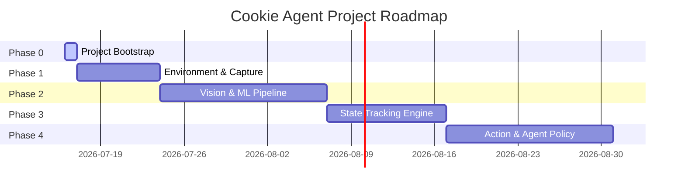

# Project Roadmap - Cookie Agent

This roadmap defines the project timeline, milestones, and target exit criteria for each development phase.

---

## Phase Overview

---

## Detailed Phases

### Phase 0: Project Bootstrap (Current)
* **Goal**: Establish repository structures, Python virtual environments, and AI collaboration guidelines.
* **Milestones**:
  - [x] Configure Python 3.12 workspace (`pyproject.toml`, `requirements.txt`).
  - [x] Write AI Constitution, Team Guidelines, and Project Context.
  - [x] Formulate specialized Agent personas and command-line templates.
  - [x] Create directory README file indicators.
* **Exit Criteria**: All files generated, linter checks pass, and structure is verified.

### Phase 1: Environment & Screen Capture
* **Goal**: Enable low-latency interaction with the Android Emulator via ADB and OS buffers.
* **Milestones**:
  - [ ] Implement target window locator and grabber (Desktop Duplication/GDI).
  - [ ] Develop ADB input simulation interface (simulate tap/hold on left/right regions).
  - [ ] Create automated runtime controller loop executing at 60 FPS.
  - [ ] Build raw dataset capture tool (saves runs as frame streams).
* **Exit Criteria**: Captured frames can be pulled in under 16ms, and control clicks register on the emulator correctly.

### Phase 2: ML & Vision Feature Extraction
* **Goal**: Parse raw pixel buffers to locate game elements in real-time.
* **Milestones**:
  - [ ] Label raw dataset frames (cookie, jellies, potions, obstacles, HP bar).
  - [ ] Train a lightweight, low-latency object detection network (e.g., custom YOLO or MobileNet).
  - [ ] Extract state variables (HP level, current score, Fever status, invincibility status).
  - [ ] Develop preprocessing and batching utility.
* **Exit Criteria**: Model inference latency is under 10ms, with Mean Average Precision (mAP) > 90% for obstacles and jellies.

### Phase 3: Game State Tracker & Engine
* **Goal**: Maintain an estimated state representation of the active run.
* **Milestones**:
  - [ ] Calculate relative scroll velocity of the background.
  - [ ] Estimate cookie physical state (jumping, sliding, air time, velocity vector).
  - [ ] Maintain an obstacle registry (current active obstacles on screen, distance, elevation).
  - [ ] Design alert triggers (e.g. collision imminent).
* **Exit Criteria**: Trajectory prediction error is under 10 pixels within a 500ms look-ahead window.

### Phase 4: Action & Agent Policy
* **Goal**: Execute optimal navigation actions to maximize runs.
* **Milestones**:
  - [ ] Build heuristic rule-based planner (handles basic jumps/slides).
  - [ ] Design a reinforcement learning environment (Gymnasium-compliant wrapper for state streams).
  - [ ] Train agent policies (e.g., PPO or DQN) on the state representation.
  - [ ] Implement evaluation tools to track score, distance, and collision metrics over runs.
* **Exit Criteria**: Agent plays autonomously, achieves high scores, and navigates complex obstacle sequences.
