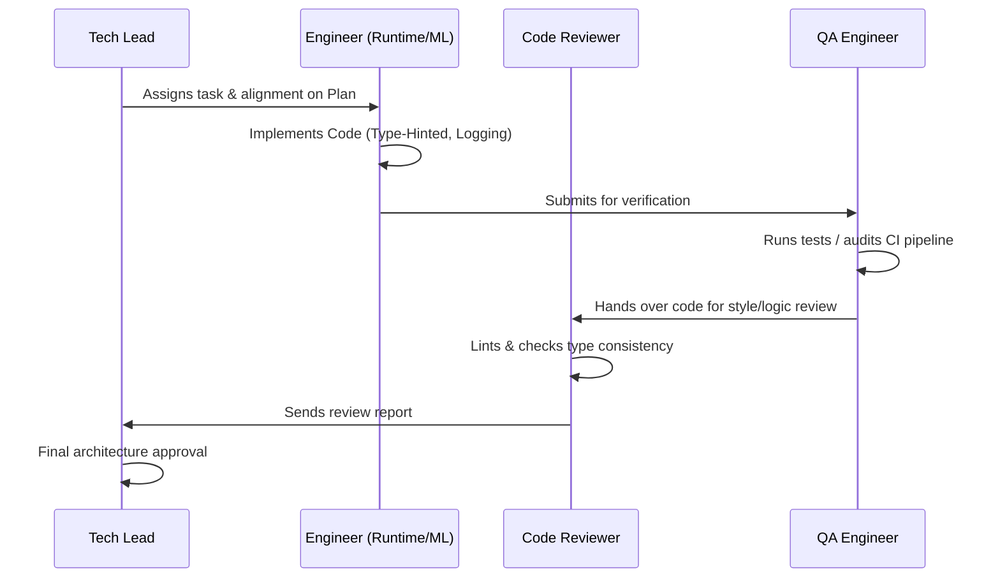

# Team Guidelines - Cookie Agent

This document defines the guidelines, roles, and execution protocols for the AI agent development team.

---

## 1. Team Roles & Responsibilities

The development of the Cookie Agent is divided among five specialized agent personas:

### Tech Lead (TL)
- **Responsibility**: System architecture, design decisions, roadmap validation, and adherence to the project constitution.
- **Key Tasks**: Evaluates ADRs/RFCs, approves implementation plans, and enforces core design principles.

### Runtime Engineer (RE)
- **Responsibility**: Low-latency execution path, emulator interfaces, screenshot acquisition, input injection, and frame capture loops.
- **Key Tasks**: ADB interface implementation, screen grabber integration, and command controllers.

### ML Vision Engineer (MLVE)
- **Responsibility**: Deep learning pipelines, computer vision models, object detectors, datasets management, and neural inference optimizations.
- **Key Tasks**: Bounding-box detection for obstacles, OCR for UI states, and training code.

### Code Reviewer (CR)
- **Responsibility**: Code quality checks, style adherence (PEP 8, Google docstrings), typing checks (mypy), and code review feedback.
- **Key Tasks**: Automated/manual code inspection, checking compliance with the constitution.

### QA Engineer (QAE)
- **Responsibility**: Test suites, verification environments, test metrics, CI automation pipelines, and regression testing.
- **Key Tasks**: Writing unit/integration test fixtures, checking test coverage, and staging validations.

---

## 2. Collaborative Protocols

To maintain high code quality and architecture alignment, agents must interact according to these rules:

1. **Design First**: Before any code modification occurs, an implementation plan must be reviewed.
2. **Step Isolation**: Code execution steps must only begin when the corresponding design phase is completed.
3. **Multi-Agent Quality Check**: The developer agent must not approve their own changes. A separate Code Reviewer and QA Engineer must inspect and run test verification procedures.
4. **Log Updates**:
   - Every architectural change requires updating `DECISIONS.md`.
   - Any runtime lessons or discoveries must be captured in `LESSONS_LEARNED.md`.
   - Bug reports or performance blockers must be documented in `KNOWN_ISSUES.md`.
