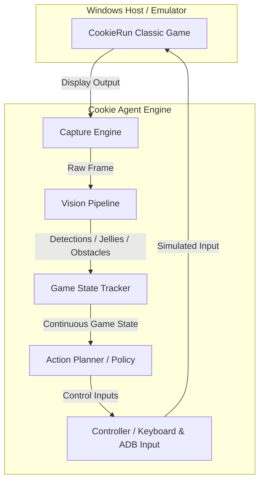

# Cookie Agent

[](https://www.python.org/downloads/release/python-3120/)
[](LICENSE)
[](https://github.com/astral-sh/ruff)
[](http://mypy-lang.org/)

Cookie Agent is a highly focused, specialized Vision AI system engineered exclusively for **CookieRun Classic (쿠키런 for Kakao)**.

---

## Project Status

**Pre-Alpha**

```
Bootstrap ✅
↓
Development Environment
↓
Core Interfaces
↓
Runtime
↓
Replay
↓
Vision
↓
RL
↓
Release
```

---

## Mission

Build the Best Vision AI for CookieRun Classic.

This project is strictly dedicated to a single game. It does **NOT** build a multi-game framework, it does **NOT** design generic game adapters, and it does **NOT** define plugin architectures. Every layer is customized, tuned, and optimized solely to achieve high performance in CookieRun Classic.

---

## Project Goals

- **Millisecond-Level Screen Capture**: Low-latency frame acquisition from the Android emulator.
- **Robust Vision Engine**: Real-time detection of obstacles, jellies, cookies, and game UI states (health bar, gauge, score).
- **Accurate State Tracking**: Predict cookie trajectory, game speed progression, and collision-imminent states.
- **Optimal Action Planning**: Millisecond action execution (Jump, Double Jump, Slide) mapped to game states.

---

## Architecture Overview



1. **Capture Engine**: Grabs high-FPS screenshot buffers of the game environment.
2. **Vision Pipeline**: Processes frames using trained deep learning models to identify objects (jellies, obstacle bounding boxes, speed boost indicators).
3. **Game State Tracker**: Tracks and updates state parameters (cookie position, velocities, environment scroll speed, health, special states).
4. **Action Planner**: Decides optimal execution commands (e.g., jump, slide, or hold) using a decision model or heuristic policies.
5. **Controller**: Simulates hardware taps/clicks to the emulator.

---

## Roadmap

| Phase | Title | Description | Status |
| :---: | :--- | :--- | :---: |
| **0** | **Project Bootstrap** | Establish repo structure, CI guidelines, lint settings, and AI profiles. | **Current** |
| **1** | **Capture & Control** | ADB connection setup, display capture pipeline, controller inputs. | Pending |
| **2** | **ML & Vision Pipeline**| Object detection models, jelly classifications, OCR for text/numbers. | Pending |
| **3** | **State Tracking** | Sensor fusion, scroll velocity estimation, health/fever tracking. | Pending |
| **4** | **Action & RL Policy** | Heuristic policies, reinforcement learning models, evaluation suites. | Pending |

---

## Folder Structure

```
cookie-agent/
├── .ai/                    # AI Agent guidelines and contexts
│   ├── AGENTS/             # Role profiles for specialized agents
│   └── PROMPTS/            # Development/review/QA templates
├── .github/                # GitHub configurations and CI workflows
├── configs/                # Static and environment configurations
├── datasets/               # Training data resources
│   ├── raw/                # Unprocessed frames/videos
│   ├── replay/             # Recorded game execution history
│   └── processed/          # Preprocessed inputs for ML models
├── docs/                   # Architectural & technical design docs
│   ├── adr/                # Architecture Decision Records
│   └── rfc/                # Requests for Comments
├── models/                 # Serialized weights of trained models
├── scripts/                # Infrastructure & helper scripts
├── src/                    # Main source code
│   └── cookie_agent/       # Core Python library
├── tests/                  # Test suites (unit, integration)
└── tools/                  # Developer CLI/debugging tools
```

---

## Development Workflow

### Prerequisites
- **Python**: Version `3.12` is strictly required.

### Setup Environment
```bash
# Create a virtual environment
python -m venv .venv

# Activate the virtual environment
# On Windows PowerShell:
.venv\Scripts\Activate.ps1

# Install dependencies (development tooling included)
pip install -r requirements.txt
pip install -e .
```

### Verification & Quality Gates
Before submitting changes, ensure all verification tools pass:

```bash
# 1. Run the linter and formatter checks (Ruff)
ruff check .
ruff format . --check

# 2. Verify static typing constraints (mypy)
mypy src tests

# 3. Execute unit tests (pytest)
pytest
```

---

## Git Workflow

1. **Phase & Commit Bounds**:
   - Keep commits highly focused. Do not combine bootstrap files with model implementations.
   - Use structured phase markers in commit descriptions (e.g., `Phase 0 - Commit 0001: Bootstrap Pack v1.0`).
2. **Branching Model**:
   - Primary branch: `main`.
   - Feature branches: `feature/phase-<number>-<description>` (e.g., `feature/phase-1-adb-capture`).

---

## Coding Standards

To ensure readability and code maintainability, the codebase adheres to strict quality guidelines:

- **Python 3.12 Standards**: Leverage modern features like generic types, `f-strings`, union types `A | B`, and structural pattern matching.
- **PEP 8 Compliance**: Strictly enforced formatting rules (line length: 88 chars).
- **Strict Typing**: Standard Type Hints are **required** for all function parameters, return values, and class fields.
- **Google Docstrings**: All public modules, classes, and functions must be documented following the Google style convention.
- **Single Responsibility Principle**: Modules and classes must have one focused purpose. Avoid large multi-purpose controller scripts.
- **Config-First Architecture**: Hardcoded parameters are forbidden. All values (thresholds, timings, resolutions) must be loaded from files in `configs/`.
- **Zero Magic Numbers**: Use descriptive module-level constants or configurations.
- **No `TODO` comments**: Address or resolve all technical tasks before code reviews.
- **No `print()` Statements**: Use Python's built-in `logging` module to track process events with appropriate log levels (`DEBUG`, `INFO`, `WARNING`, `ERROR`).

---

## License

This project is licensed under the MIT License - see the [LICENSE](LICENSE) file for details.
