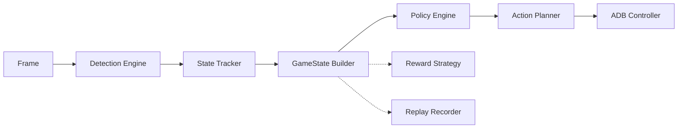
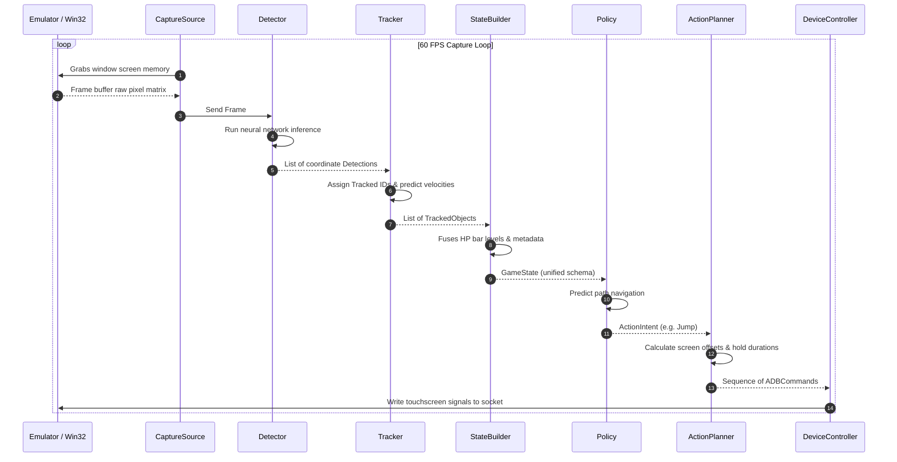

# Software Design Specification: Core Interfaces

This document defines the frozen contract specifications, data structures, and communication protocols for the **Cookie Agent** engine.

---

## 1. Architecture Overview

Processing pipelines within the Cookie Agent follow a strictly sequential execution model:

1.  **Frame**: Lossless graphical buffer captured from the target Android Emulator execution window.
2.  **Detection**: Extracts raw bounding box elements (obstacles, jellies, cookies) from the frame.
3.  **Tracker**: Links continuous bounding boxes across time steps to construct object trajectories and background scroll speeds.
4.  **GameState Builder**: Fuses tracking histories with static config guidelines and optional metadata hints to output a single unified state description.
5.  **Reward**: Evaluates the step state change to generate reinforcement learning performance scores.
6.  **Policy**: Decision-maker predicting the next motion behavior (e.g. jump, slide).
7.  **Action Planner**: Translates abstract motion intents into concrete tactile command offsets and intervals.
8.  **ADB Controller**: Inject touch coordinates and signals directly to emulator socket pipes.
9.  **Replay Recorder**: Asynchronously registers observation state snapshots to logs.

---

## 2. Data Models

This section describes the conceptual data models defining system state contracts.

### Frame
- **Purpose**: Wraps raw screen graphics buffer data.
- **Responsibilities**: Carry timestamp, dimensions, and raw pixel channels.
- **Owner**: `CaptureSource`
- **Inputs**: Graphical desktop/window buffer.
- **Outputs**: Normalized pixel matrix.
- **Relationships**: Fed into `Detector`.

### BBox
- **Purpose**: Defines a two-dimensional bounding region on the screen coordinate space.
- **Responsibilities**: Holds coordinate limits (`xmin, ymin, xmax, ymax`) and detection confidence.
- **Owner**: `Detector`
- **Inputs**: Calculated box regions.
- **Outputs**: Rectangular boundaries.
- **Relationships**: Embedded inside `Detection` models.

### Detection
- **Purpose**: Encapsulates a raw object class predicted on a single frame.
- **Responsibilities**: Wraps `BBox`, classification category (e.g., jelly, obstacle), and prediction confidence.
- **Owner**: `Detector`
- **Inputs**: Frame inference outputs.
- **Outputs**: Labeled box instances.
- **Relationships**: Fed into the `Tracker` module.

### TrackedObject
- **Purpose**: Represents an active, uniquely identified game element tracked over multiple frames.
- **Responsibilities**: Maintain object ID, classification, velocity vector, and trajectory history.
- **Owner**: `Tracker`
- **Inputs**: Sequence of spatial Detections.
- **Outputs**: Position vectors across time.
- **Relationships**: Fed into the `GameState Builder`.

### PlayerState
- **Purpose**: Captures status parameters of the cookie.
- **Responsibilities**: Tracks health level (HP), jumping/sliding states, fever mode indicators, invincibility frames, and speed buffs.
- **Owner**: `GameState Builder`
- **Inputs**: Tracker annotations and frame OCR results.
- **Outputs**: Typed player status properties.
- **Relationships**: Embedded inside the `GameState`.

### MapHint
- **Purpose**: Optional static metadata outlining static obstacle or jelly layouts.
- **Responsibilities**: Pre-load map structures to optimize path planning.
- **Owner**: Developer configurations.
- **Inputs**: Static configuration JSON/YAML files.
- **Outputs**: Scheduled target locations.
- **Relationships**: Optional input parameter to the `GameState Builder`.

### GameState
- **Purpose**: The single source of truth describing the entire game environment at any specific moment.
- **Responsibilities**: Integrates `PlayerState`, list of active `TrackedObject` sequences, background scroll speed, and scroll distance.
- **Owner**: `GameState Builder`
- **Inputs**: Fused tracker data.
- **Outputs**: Frozen environment state maps.
- **Relationships**: Fed into `Policy`, `RewardStrategy`, and `ReplayObserver`.

### ActionIntent
- **Purpose**: Abstract motion behavior decision.
- **Responsibilities**: Declares jump levels (NO_ACTION, JUMP, DOUBLE_JUMP) or slide status (SLIDE_START, SLIDE_HOLD, SLIDE_END).
- **Owner**: `Policy`
- **Inputs**: GameState metrics.
- **Outputs**: Motion behavior flags.
- **Relationships**: Fed into `ActionPlanner`.

### ADBCommand
- **Purpose**: Low-level emulator command.
- **Responsibilities**: Holds device touch event details (input file target, X/Y coordinates, tap durations, delays).
- **Owner**: `ActionPlanner`
- **Inputs**: Motion behavior mappings.
- **Outputs**: Tactile click instruction streams.
- **Relationships**: Executed by `DeviceController`.

### RewardEvent
- **Purpose**: Serialized evaluation metric for RL step changes.
- **Responsibilities**: Holds step-wise reward values, event classifications (e.g. collision, jelly collected), and metadata.
- **Owner**: `RewardStrategy`
- **Inputs**: GameState transitions.
- **Outputs**: Numeric reward signals.
- **Relationships**: Fed to external training loops.

---

## 3. Protocols

This section freezes component interface behavior rules.

### CaptureSource
- **Purpose**: Acquires frames from the Android emulator window.
- **Input**: None (polls target application handles).
- **Output**: `Frame`
- **Responsibilities**: Find emulator window, capture display graphic memory, attach timestamps, and export pixel arrays under 16.6ms.
- **Implementation Notes**: Must support non-blocking asynchronous loops, returning empty or error flags if the window loses focus.

### Detector
- **Purpose**: Run inference to find screen coordinates of game elements.
- **Input**: `Frame`
- **Output**: List of `Detection` structures
- **Responsibilities**: Run deep learning models, filter box boundaries via confidence thresholds, and assign classification labels.
- **Implementation Notes**: Must operate within 10ms target duration, strictly reading configuration model paths from static JSON/YAML setups.

### Tracker
- **Purpose**: Links frames across the timeline to follow obstacles and jellies continuously.
- **Input**: List of `Detection` structures
- **Output**: List of `TrackedObject` structures
- **Responsibilities**: Generate unique entity IDs, predict trajectories using velocity frames, and prune dead objects that exited the viewport.
- **Implementation Notes**: Leverages simple distance thresholds or linear estimators to avoid heavy computational overhead.

### StateBuilder
- **Purpose**: Compose the unified, synchronized game state structure.
- **Input**: List of `TrackedObject` structures, `Frame` (for direct meters OCR), and optional `MapHint`
- **Output**: `GameState`
- **Responsibilities**: Calculate player HP meter height, parse background scrolling velocities, align coordinates, and output standard state schemas.
- **Implementation Notes**: Combines tracker outputs and lightweight template matchers to isolate status indicators (e.g. fever mode).

### RewardStrategy
- **Purpose**: Evaluates step changes to score action outcomes.
- **Input**: Previous `GameState`, Current `GameState`
- **Output**: `RewardEvent`
- **Responsibilities**: Assign positive points for distance traversed and jellies collected, and negative points for collisions or health losses.
- **Implementation Notes**: Exposes configurable weight constants inside `configs/`.

### Policy
- **Purpose**: Decision-making controller choosing movement objectives.
- **Input**: `GameState`
- **Output**: `ActionIntent`
- **Responsibilities**: Predict next locomotion behavior (jump, slide, hold) to traverse obstacles safely.
- **Implementation Notes**: Must support both rule-based heuristics and deep reinforcement learning neural execution environments.

### ActionPlanner
- **Purpose**: Translates movement decisions into tap triggers.
- **Input**: `ActionIntent`, `GameState` (for speed validation)
- **Output**: Sequence of `ADBCommand` instructions
- **Responsibilities**: Map intents to coordinates on left/right regions of emulator screen, compute press hold durations, and inject delays.
- **Implementation Notes**: Adjusts press intervals dynamically based on background scrolling speed.

### DeviceController
- **Purpose**: Injects touch signals to the emulator.
- **Input**: Sequence of `ADBCommand` instructions
- **Output**: Success / Failure indicator
- **Responsibilities**: Translate commands to low-level touch events and write directly to device socket streams.
- **Implementation Notes**: Must optimize connection pipelines to avoid command queue clogging.

### ReplayObserver
- **Purpose**: Logs observations for behavior modeling.
- **Input**: `GameState`, `ActionIntent`, `RewardEvent`
- **Output**: None (saves directly to storage)
- **Responsibilities**: Serialize state data step-by-step to JSONL files.
- **Implementation Notes**: Operates asynchronously to prevent slowing down the main execution loop.

---

## 4. Design Rules

1.  **Vision is Ground Truth**: The visual layout is the absolute state representation. Sensor predictions must never be overridden by historical map models if they conflict.
2.  **MapHint is Optional**: The system must run successfully on pure visual input when no map configuration metadata exists.
3.  **Policy Outputs Intent Only**: Decision models choose behaviors (e.g., Jump), not coordinates. Action planners handle coordinate translations.
4.  **Planner Converts Intent into Commands**: All pixel offsets and timing parameters are calculated by the action planner, keeping the policy clean of tactile dependencies.
5.  **Replay Records Raw Observations**: Do not record derived features or model weights. Store raw inputs to support future model testing.
6.  **Reward is Computed from State Transitions**: Reward values are calculated strictly by evaluating step-wise differences in game states.
7.  **No Module Directly Depends on PPO**: Policy abstractions must not reference specific RL algorithms (like PPO). They must remain algorithm-agnostic.
8.  **Everything Communicates Through Interfaces**: Strict separation of concerns is maintained; direct coupling between runtime captures and vision models is prohibited.

---

## 5. Data Flow

---

## 6. Versioning

### Schema Version
- All data models (`GameState`, `Detection`, etc.) must include a string metadata key: `schema_version` (e.g. `1.0.0`).
- Major schema versions indicate breaking structure shifts.

### Backward Compatibility
- Serialized datasets (`datasets/replay/`) containing older schema versions must be convertible to newer shapes via conversion utilities.

### Future Extension Rules
- All new attributes added to models must be optional, with declared defaults.
- Adding fields to schemas requires matching modifications inside target ADR records.
