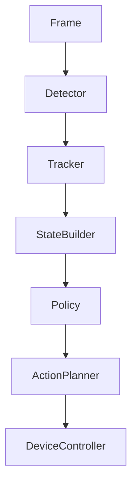
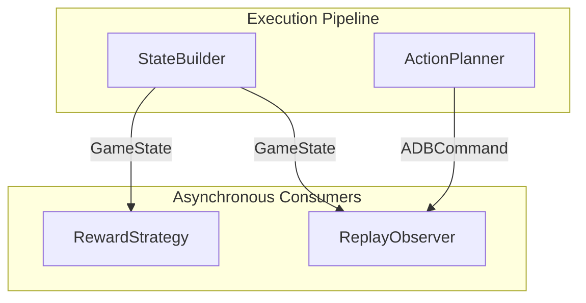
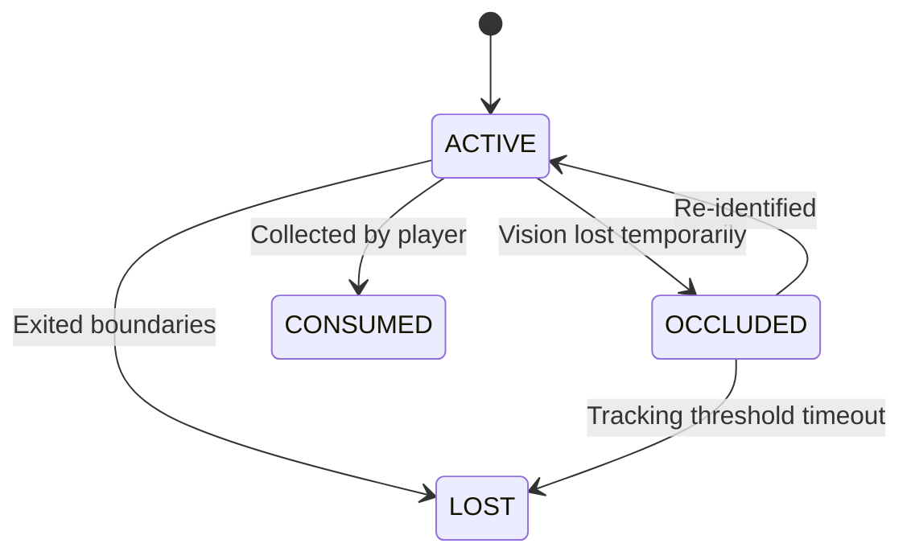
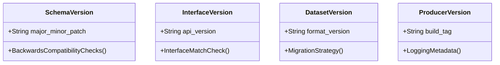

# Software Design Specification: Core Interfaces

This document defines the frozen architectural specifications, data structures, and communication protocols for the **Cookie Agent** engine.

---

## 1. Architecture Overview

### Execution Pipeline
The Cookie Agent core execution loop runs as a strictly sequential, low-latency pipeline to process graphical inputs and emit tactile commands:

1.  **Frame**: Lossless graphical buffer captured from the target Android Emulator execution window.
2.  **Detector**: Run image inference to extract bounding boxes of active objects on screen.
3.  **Tracker**: Tracks objects across multiple frames to compute continuous velocities and trajectories.
4.  **StateBuilder**: Fuses tracker outputs, OCR metrics, character metadata, and prior states to construct a unified `GameState`.
5.  **Policy**: Decision-making model predicting high-level movement objectives.
6.  **ActionPlanner**: Maps motion intents to emulator screen coordinates, tap offsets, and touch hold timings.
7.  **DeviceController**: Inject click and drag inputs to the emulator TCP socket streams.

### Asynchronous Pipeline Consumers
The `RewardStrategy` and `ReplayObserver` are **not** part of the critical, low-latency execution path. Instead, they act as asynchronous consumers of the outputs from the pipeline steps:

-   **RewardStrategy**: Evaluates `GameState` transitions asynchronously to calculate rewards for training.
-   **ReplayObserver**: Logs raw observations (`Frame`, `ADBCommand`, and associated meta-properties) to disk for behavior replication, regression tests, and offline reinforcement learning.

---

## 2. Data Models

### Frame
- **Purpose**: Wraps raw screen capture buffers.
- **Owner**: `CaptureSource`
- **Inputs**: Window graphic memory stream.
- **Outputs**: Lossless pixel matrix.
- **Relationships**: Fed into `Detector` and `ReplayObserver`.

### BBox
- **Purpose**: Defines a 2D bounding region on the screen coordinate plane.
- **Owner**: `Detector`
- **Inputs**: Coordinate bounds calculations.
- **Outputs**: Normalized bounding boundaries (`xmin`, `ymin`, `xmax`, `ymax`).
- **Relationships**: Contained within `Detection` and `TrackedObject`.

### Detection
- **Purpose**: Conceptual output representation of a single inferred object.
- **Owner**: `Detector`
- **Properties**:
  - **Frame ID**: Identifies which frame generated the prediction.
  - **Timestamp**: Time of frame capture (used to verify latency).
  - **Class**: Entity type classification (e.g., OBSTACLE, JELLY, POTION).
  - **BBox**: Spatial box region coordinates.
  - **Confidence**: Inference probability score.
  - **Lane (Optional)**: Segmented vertical zone index indicating layout positioning.
  - **Detector Name**: String tag indicating which model version performed the check.
- **Relationships**: Generated by `Detector`, consumed by `Tracker`.

### TrackedObject
- **Purpose**: Follows a specific entity over time to determine velocity and state.
- **Owner**: `Tracker`
- **Properties**:
  - **Object ID**: Persistent identifier across frames.
  - **Detection**: Bounding coordinates and confidence.
  - **Velocity Vector**: Calculated pixel delta per second.
  - **Lifecycle State**: Active tracker status tracking (see Section 4).
- **Relationships**: Produced by `Tracker`, consumed by `StateBuilder`.

### PlayerState
- **Purpose**: Captures state variables of the running character.
- **Owner**: `StateBuilder`
- **Properties**:
  - **Velocity**: Speed vector of the character.
  - **Jump Phase**: Categorical value tracking jump status (`GROUNDED`, `FIRST_JUMP`, `SECOND_JUMP`, `FALLING`).
  - **Airborne**: Boolean flag specifying if the cookie is in the air.
  - **Grounded**: Boolean flag specifying if the cookie is touching a platform.
  - **Time Since Last Jump**: Temporal tracker to avoid command spam.
  - **Time Since Last Damage**: Temporal tracker to compute post-damage invincibility durations.
  - **Relay Available**: Boolean flag indicating if a backup character remains.
  - **Buffs (Optional Metadata)**: Dynamic key-value pairs carrying passive statuses (e.g. Giant, Blast, Magnet).
- **Relationships**: Contained within `GameState`.

### MapHint
- **Purpose**: Advisory metadata outlining known upcoming obstacles.
- **Owner**: Configurations
- **Inputs**: Configuration files.
- **Outputs**: Static coordinate queues.
- **Relationships**: Advisory input to `StateBuilder`.

### GameState
- **Purpose**: Consolidated environment layout representation at a given step.
- **Owner**: `StateBuilder`
- **Properties**:
  - **PlayerState**: Character metrics.
  - **TrackedObjects**: Active entities in the viewport.
  - **Background Scroll Speed**: Visual scrolling rate.
  - **Scroll Distance**: Traversed path offset.
  - **Schema Version**: Format compatibility tag.
- **Relationships**: Consumed by `Policy`, `RewardStrategy`, and `ReplayObserver`.

### ActionIntent
- **Purpose**: Abstract motion decisions.
- **Owner**: `Policy`
- **Options**: `NONE`, `JUMP`, `SLIDE`, `RELAY`.
- **Relationships**: Emitted by `Policy`, consumed by `ActionPlanner`.

### ADBCommand
- **Purpose**: Structured input instruction to trigger.
- **Owner**: `ActionPlanner`
- **Properties**:
  - **Event Type**: Event type specifier (e.g., TouchDown, TouchMove, TouchUp).
  - **Coordinates**: Precise X/Y pixel coordinates.
  - **Hold Duration**: Button press duration in milliseconds.
  - **Delay**: Pause before sending next command.
- **Relationships**: Executed by `DeviceController`, recorded by `ReplayObserver`.

### RewardEvent
- **Purpose**: Performance metrics for RL environments.
- **Owner**: `RewardStrategy`
- **Properties**:
  - **Value**: Reward scalar.
  - **Event Type**: Event classification (e.g., COLLISION, FEVER_ENTER, Potions Collected).
- **Relationships**: Emitted by `RewardStrategy`.

---

## 3. Protocols

### CaptureSource
- **Input**: None (polls target application handles).
- **Output**: `Frame`
- **Responsibilities**: Grabs lossless emulator graphic memory buffers within 16.6ms.

### Detector
- **Input**: `Frame`
- **Output**: List of `Detection` structures
- **Responsibilities**: Infers object categories and coordinates using weights configured under `models/`.

### Tracker
- **Input**: List of `Detection` structures
- **Output**: List of `TrackedObject` structures
- **Responsibilities**: Links object identifiers across consecutive frame instances, tracks entity lifecycles, and computes velocities.

### StateBuilder
- **Input**: List of `TrackedObject` structures, `OCR Results` (parsed health/scores), `Character Status` metadata, optional `MapHint`, and optional `Previous GameState`.
- **Output**: `GameState`
- **Responsibilities**:
  - Construct the unified frame state context.
  - Reference `Previous GameState` to derive temporal tracking properties: character velocity, jump phase transitions, active timers, and cooldown parameters.

### RewardStrategy
- **Input**: Previous `GameState`, Current `GameState`
- **Output**: `RewardEvent`
- **Responsibilities**: Compute scalar reinforcement training metrics.

### Policy
- **Input**: `GameState`
- **Output**: `ActionIntent`
- **Responsibilities**: Evaluate spatial threats to decide high-level navigation actions.
- **Implementation Note**: Interface must remain algorithm-agnostic; no references to reinforcement learning backends (like PPO) are allowed.

### ActionPlanner
- **Input**: `ActionIntent`, `GameState` (current scroll velocity)
- **Output**: Sequence of `ADBCommand` instructions
- **Responsibilities**: Map abstract motion intents to hardware event streams. Calculates multi-jump logic, press timings, key release parameters, and implements random coordinate offsets to mimic human inputs.

### DeviceController
- **Input**: Sequence of `ADBCommand` instructions
- **Output**: Success indicator
- **Responsibilities**: Transmits input instructions to emulator pipes.

### ReplayObserver
- **Input**: `Frame`, Sequence of `ADBCommand` instructions, and `Metadata` (timestamps, runtime configs).
- **Output**: None (serializes snapshot files asynchronously)
- **Design Rationale**: 
  - The replay dataset stores only raw graphical observation records and input commands. 
  - By avoiding the logging of derived representations (like `GameState` or `Detections`), we ensure that downstream components (`Detector`, `Tracker`, `StateBuilder`) can be fully rebuilt, optimized, and tested regression-free by re-running historical replay datasets through modified pipelines.

---

## 4. Tracker Lifecycle States

`TrackedObject` handles entity identity transitions using four operational states:

-   **ACTIVE**: The object is currently visible in the active viewport and updated by new frame detections.
-   **OCCLUDED**: The object's visual bounds are temporarily blocked by other entities or screen clutter. The tracker maintains trajectory estimations without visual confirmation.
-   **CONSUMED**: The object is collected or destroyed by active player interaction (e.g. collecting a jelly or coin).
-   **LOST**: The object is pruned because it exited viewport boundaries or tracking estimates failed to associate with new detections within a set frame threshold.

### Rationale: CONSUMED vs. LOST
It is critical to distinguish between `CONSUMED` and `LOST` because they reflect different semantic events in the game. `CONSUMED` triggers positive scores and registers successful interactions. `LOST` indicates obstacles that were avoided or jellies that were missed.

---

## 5. Design Rules

1.  **Vision is Ground Truth**: The visual layout is the absolute state representation. Sensor predictions must never be overridden by historical map models if they conflict.
2.  **Replay Stores Raw Observations Only**: Save only raw graphical input (`Frame`), output interactions (`ADBCommand`), and setup configurations (`Metadata`).
3.  **Policy Never Emits Coordinates**: Policies output abstract movement categories only (`JUMP`, `SLIDE`). Handlers and coordinate layouts are owned by the `ActionPlanner`.
4.  **Planner Owners Timing**: Precise hold durations, click intervals, and humanization delays are calculated entirely by the `ActionPlanner`.
5.  **Interfaces are Algorithm Agnostic**: Design contracts must never inherit from specific training backends. No module may depend directly on PPO.
6.  **Previous GameState is Allowed Only Inside StateBuilder**: Execution modules must remain stateless. Only the `StateBuilder` may access historical `GameState` to calculate temporal features.
7.  **MapHint is Advisory Only**: Map templates are used as hints. The agent must execute correctly if hints are absent or conflict with active visual detections.

---

## 6. Versioning

### Version Schemas
1.  **Schema Version**: Governs serialization format layouts of models like `GameState`. Semantic versioning applies.
2.  **Interface Version**: Controls API contract stability for protocols.
3.  **Dataset Version**: Identifies data structures inside raw record files (`datasets/`).
4.  **Producer Version**: Identifies code commit tags.

### Replay Compatibility & Migration
To verify new pipelines on historical data:
- Converting legacy records requires written migration handlers that read deprecated dataset formats and parse them into newer schemas.
- Minor version revisions must remain backward-compatible. Major revisions require running migration CLI tools to convert historical database buffers.

---

## 7. Architecture Quality

-   **Low Coupling**: Pipeline steps interact through defined interfaces using standard data models. Replacing the `Detector` has zero effect on the `Policy`.
-   **High Cohesion**: Each component focuses on one specific task (e.g., `Detector` focuses purely on spatial predictions, leaving velocity calculations to `Tracker`).
-   **Replay Compatibility**: Raw frame recordings allow complete offline reproduction of run states.
-   **Offline RL Compatibility**: Saving raw frame-action pairs allows training policy networks via behavior cloning without live emulator instances.
-   **Future replacements**: The clean separation of `Policy` and `ActionPlanner` makes it easy to switch between simple heuristic policies and advanced RL agents.
-   **Multi-character & Multi-resolution Support**: Resolution scale matrices reside in configurations, allowing the `StateBuilder` to output normalized spatial state boundaries.
